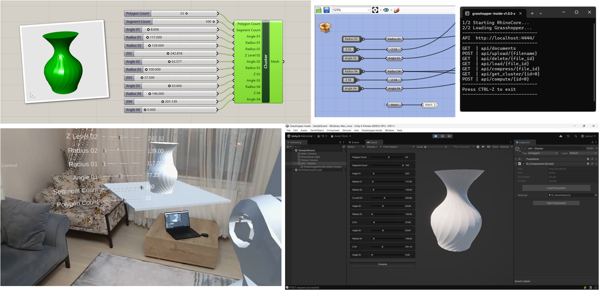
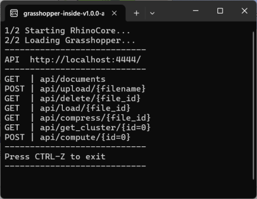
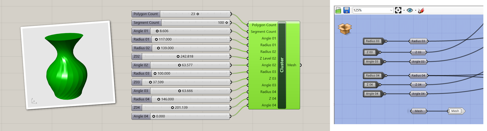
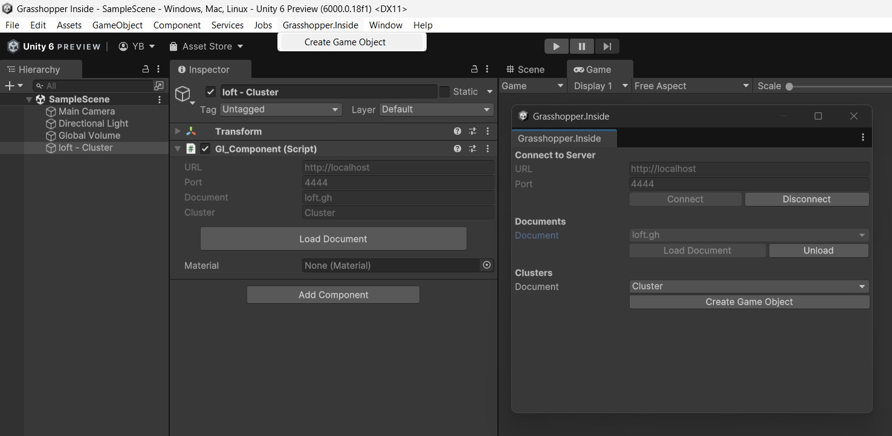
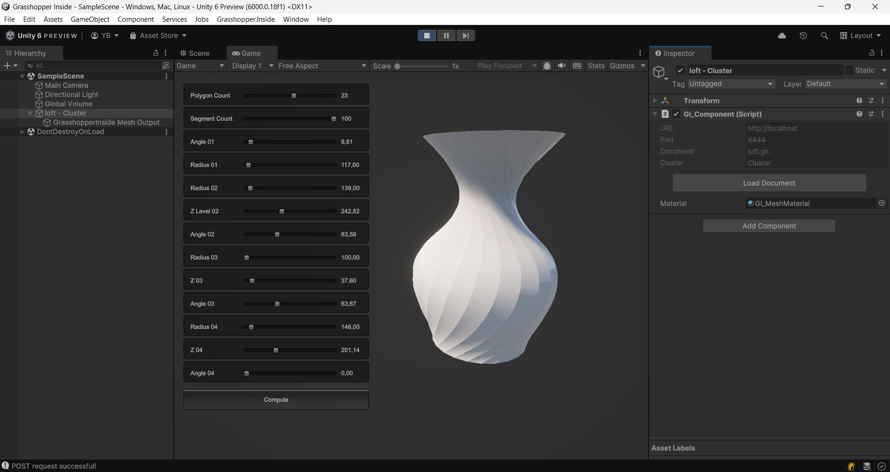

# Grasshopper.Inside

This **REST API Server** application has been developed for the **Grasshopper3D** program to enable communication with mixed-reality devices, and mobile devices. By default, the Grasshopper3D parametric modeling tool is not accessible from other devices, such as mobile devices or mixed-reality headsets, as it runs only on the computer where the program is installed.

In this project, I developed an **Application Programming Interface (API)** that allows to access the Grasshopper3D parametric modeling tool via an HTTP interface. Users can send input parameters through HTTP requests from their mixed-reality headsets or mobile devices. The Grasshopper3D tool processes these input parameters, calculates the results, and returns them as HTTP responses to the devices.

The REST API Server software can be accessed through various client devices, including web browsers, mobile devices, headsets, or other software applications. While processing the HTTP requests and returning the HTTP responses, the Grasshopper3D program runs in headless mode in the background.

[](https://www.youtube.com/watch?v=92krsDt8qys&list=PLv0cS6BsK0uJxEhYNfP0xsXtbNSO0baUR&index=5)

[Grasshopper.Inside Robotic Fabrication Youtube Playlist](https://www.youtube.com/watch?v=92krsDt8qys&list=PLv0cS6BsK0uJxEhYNfP0xsXtbNSO0baUR&index=5)

To enable Grasshopper3D to respond to incoming requests, the **[Rhino.Inside](https://www.rhino3d.com/features/rhino-inside/)** feature—introduced in the 7th version of the [Rhino3D](https://www.rhino3d.com/)
 program—has been extended. Rhino.Inside is an open-source project that allows Rhino3D and Grasshopper3D to be used within other applications running on the same computer, such as [Autodesk Revit](https://www.autodesk.com/products/revit/overview)
 and [Unity](https://unity.com/).

This project implements primitive data types, including `boolean`, `integer`, `double`, and `string`, as well as RhinoCommon SDK data types such as `arc`, `box`, `circle`, `curve`, `line`, `mesh`, `mesh face`, `plane`, `point`, `rectangle`, and `vector`. These data types can be utilized as both **input** and **output** parameters for REST API Server communication requests and responses.

---
## How to Install

### Step 1: Download and Run the Executable
1. Download the executable zip file from the [grasshopper.inside-v1.0.0-alpha](https://github.com/yusufbuyruk/grasshopper.inside/releases/tag/v1.0.0-alpha).
2. Extract the zip file.
3. Run the `GrasshopperInside.exe` executable file.



### Step 2: Set Up Unity Project
1. Open Unity Hub and create a new Unity project.
   - **Recommended template**: Universal Render Pipeline (URP) 3D.
   - URP is commonly used in headset and mobile development for optimized performance.

### Step 3: Install Newtonsoft Package
1. Open the **Package Manager** in Unity.
   - Go to `Window` > `Package Manager`.
2. Select **Install Package by Name** and enter: ```com.unity.nuget.newtonsoft-json```

### Step 4: Import the Grasshopper Package
1. Download the Unity custom package file from the [grasshopper_inside.unitypackage](https://github.com/yusufbuyruk/grasshopper.inside/releases/download/v1.0.0-alpha/grasshopper_inside.unitypackage).
2. Import the custom package ```grasshopper-inside.unitypackage```.
- Go to `Assets` > `Import Package` > `Custom Package` and select the file.

### Step 5: Create Grasshopper3d Definition File
1. **Create a Cluster:** Create your definition file within a cluster.
2. **Define Parameters:** The input and output parameters of this cluster will be utilized for REST API communication.
3. **Set Slider Values:** To set minimum, maximum and default values for sliders, add integer or number sliders to the input nodes of this cluster.



### Step 6: Create and Configure Game Objects
1. From the **Grasshopper.Inside** menu, select `Create Game Object`.

2. Follow the steps to set up your game object:
- **6.a**: Press "Connect" to establish a connection to the server.
- **6.b**: Press "Load Document" to load a Grasshopper definition document.
- **6.c**: Press "Create Game Object" to create the game object.
 
- **6.d**: Press "Play" to run the project.
 


---
## Requirements

- **Rhino v8**
- **Visual Studio 2022**
- **.Net Framework 4.8**
- **NuGet Package Manager Console**
  - Run the following commands to install the required packages:
    ```
    Install-Package Microsoft.AspNet.WebApi.OwinSelfHost
    Install-Package Rhino.Inside
    ```
  - Package Manager Settings Options
  - Navigate to: `NuGet Package Manager` > `General`
  - Set `Package Management Default package management format` to `PackageReference`


---
## Share and Cite
- **MDPI and ACS Style**
  - Buyruk, Y.; Çağdaş, G. Interactive Parametric Design and Robotic Fabrication within Mixed Reality Environment. *Appl. Sci.* **2022**, 12, 12797. [https://doi.org/10.3390/app122412797](https://doi.org/10.3390/app122412797)
- **AMA Style**
  - Buyruk Y, Çağdaş G. Interactive Parametric Design and Robotic Fabrication within Mixed Reality Environment. *Applied Sciences*. 2022; 12(24):12797. [https://doi.org/10.3390/app122412797](https://doi.org/10.3390/app122412797)
- **Chicago/Turabian Style**
  - Buyruk, Yusuf, and Gülen Çağdaş. 2022. "Interactive Parametric Design and Robotic Fabrication within Mixed Reality Environment" *Applied Sciences* 12, no. 24: 12797. [https://doi.org/10.3390/app122412797](https://doi.org/10.3390/app122412797)
- **Bibtex**
 ```
 @article{Buyruk2022,
   author = {Yusuf Buyruk and Gülen Çağdaş},
   title = {Interactive Parametric Design and Robotic Fabrication within Mixed Reality Environment},
   journal = {Applied Sciences},
   year = {2022},
   volume = {12},
   number = {24},
   pages = {12797},
   doi = {10.3390/app122412797},
   url = {https://doi.org/10.3390/app122412797}
 }
 ```
